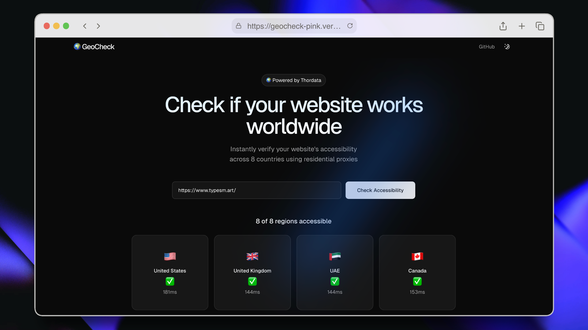

# 🌍 GeoCheck

Ever wondered if your site *actually* loads for users in Dubai, Tokyo, London or whichever country most of users come from?

VPNs are slow and manual checks are a pain. I built **GeoCheck** to solve exactly that. Just paste your URL, and it instantly ping it from residential proxies in 8 different countries to show you exactly the load times and the status of your site.



## ✨ Features

- **8-Country Geo-Checking**: Instantly verify website accessibility in US, UK, UAE, Canada, Germany, France, Australia, and Japan
- **Real-time Results**: See status icons (✅/❌/⚠️) and response times for each region
- **Beautiful UI**: Built with Next.js 15, ShadcnUI, and Tailwind CSS v4
- **Smooth Animations**: Powered by Framer Motion
- **Demo Mode**: Works without credentials for testing
- **Error Handling**: Clear validation for empty and invalid URLs

## 🚀 Quick Start

```bash
# Clone the repository
git clone https://github.com/nimish-html/geocheck.git
cd geocheck

# Install dependencies
npm install

# Run development server
npm run dev
```

Open [http://localhost:3000](http://localhost:3000) to see the app.

## 🔧 Configuration

### Thordata Proxy Setup (Optional)

For production use with real geo-checking:

1. Copy the environment example file:
   ```bash
   cp .env.example .env.local
   ```

2. Add your [Thordata](https://www.thordata.com/?ls=Reddit&lk=sh) credentials:
   ```env
   THORDATA_PROXY_HOST=your_proxy_host.pr.thordata.net
   THORDATA_PROXY_PORT=9999
   THORDATA_USER=td-customer-YOUR_USERNAME
   THORDATA_PASS=your_password
   ```

3. Restart the dev server

> **Note**: Without credentials, the app runs in demo mode with simulated results.

## 📦 Tech Stack

- **Framework**: [Next.js 15](https://nextjs.org/) with Turbopack
- **UI Library**: [ShadcnUI](https://ui.shadcn.com/)
- **Styling**: [Tailwind CSS v4](https://tailwindcss.com/)
- **Language**: TypeScript
- **Animations**: [Framer Motion](https://www.framer.com/motion/)
- **Proxy Service**: [Thordata Residential Proxies](https://www.thordata.com/?ls=Reddit&lk=sh)

## 🌐 How It Works

1. User enters a website URL
2. App makes parallel requests through residential proxies in 8 countries
3. Each request checks if the website is accessible from that geo
4. Results display with status icons and response times

## 📁 Project Structure

```
geocheck/
├── app/
│   ├── api/check-geo/     # API endpoint for geo-checking
│   ├── globals.css        # Global styles
│   ├── layout.tsx         # Root layout
│   └── page.tsx           # Main page
├── components/
│   ├── geo-checker.tsx    # Main geo-checker component
│   ├── navbar.tsx         # Navigation bar
│   ├── footer.tsx         # Footer
│   └── ui/                # ShadcnUI components
└── .env.example           # Environment variables template
```

## 🚢 Deployment

Deploy to Vercel with one click:

[](https://vercel.com/new/clone?repository-url=https://github.com/nimish-html/geocheck)

Don't forget to add your environment variables in the Vercel dashboard!

## 📝 License

MIT License - see [license.txt](license.txt)

## 🙏 Acknowledgments

- Built with [SaaS Landing Template](https://github.com/gonzalochale/saas-landing-template)
- Powered by [Thordata](https://www.thordata.com/?ls=Reddit&lk=sh) residential proxies
- UI components from [ShadcnUI](https://ui.shadcn.com/)

---

Made with ❤️
